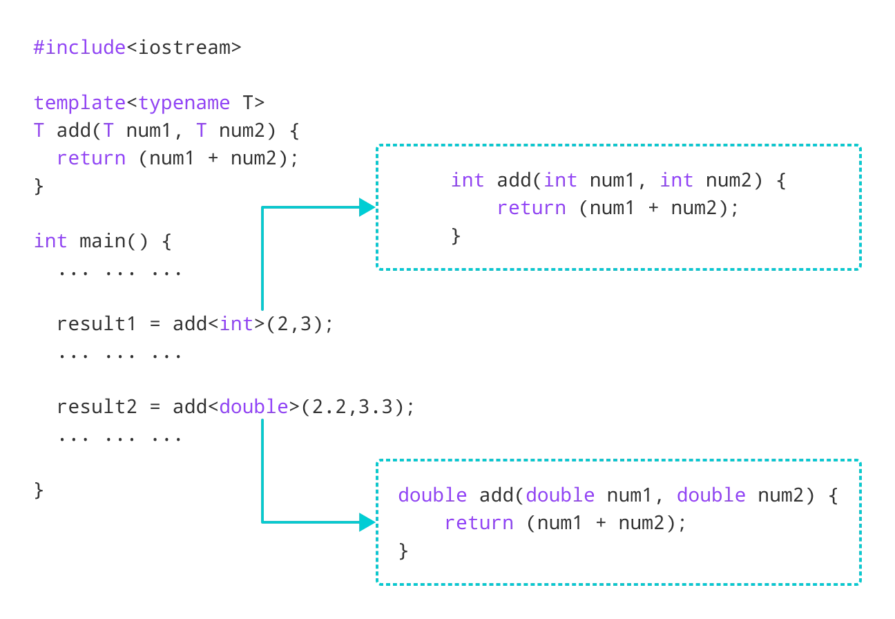

## **Geant4 overview and C++ concepts**

Deepak Samuel
Central University of Karnataka

```NEUS 2024```

---
## **Geant4**

- A C++ toolkit to simulate particle interactions with matter
- Applications: high energy, nuclear and accelerator physics, as well as studies in medical and space science.

- **Toolkit:** You use it build your own framework - garbage in - garbage out

- Takes sometime to understand, especially for beginners in C++.

- Bonus of learning Geant4: improvement in C++ skills

---

# **Datatypes in C++**

| **Datatype**    | example            |
|------------|--------------|
| **int**  | 8         |
| **float**  | 8.32         |
| **double** | 8.3457687686 |
| **bool**   | 0/1          |
| **void**   | ?            |
---

# **Class in C++**

- A class is a user defined datatype with its own  data members and member functions or methods.
- Example: 2 x 2 Matrix class: 
    - 4 data members
    - functions or methods to find determinant

 ```c
    class Matrix{
        int a00; // data members
        int a01;
        int a10;
        int a11;

        float determinant(){
            return a00*a11 - a10*a01; // method or a function
        }
    };
```
---

# **File and folder structure**

***Header file (Matrix.h or Matrix.hh files)***
 ```c
    class Matrix{
        int a00; // data members
        int a01;
        int a10;
        int a11;
        float determinant(); // function declaration
    };
```

***Source file (Matrix.cxx or Matrix.cpp files)***

 ```c
 float Matrix::determinant() // function definition
 {
      return a00*a11 - a10*a01; // method or a function
 }
```

- data members have no brackets `()` whereas functions do 

---


# **Geant4 on Github:**

- All header files inside include folder
- All source files inside src folder

> https://github.com/Geant4/geant4/tree/master/examples/basic/B1

> https://github.com/Geant4/geant4/blob/master/examples/basic/B1/include/DetectorConstruction.hh

> https://github.com/Geant4/geant4/blob/master/source/run/include/G4VUserDetectorConstruction.hh


---


# **C++ objects and pointers**

The Matrix class only defines the data members and functions. In order to use it, you have to either

- Create an object: 
    - ```Matrix m```
    - Now, m is called as object of class Matrix

- or Create an pointer to an object:
    - ```Matrix *m = new Matrix()```
    - Now m is the pointer to an object of class Matrix.

- `Quiz` 

---
# **Accessing functions or methods using objects and pointers**

Once an object or pointer is created, you can access the members of the class: 

- Using the object: 
    - ```Matrix m```
    - m.determinant()

- or using the pointer to an object:
    - ```Matrix *m = new Matrix()```
    - m->determinant();

- The dot operator is used on object while the arrow operator is used on pointers.

---

# **Constructors and destructors**

```c 
Matrix m
m.determinant()
```

```c
Matrix *m = new Matrix()
m->determinant();
```
After the above two lines, what would be the value of the determinant? 

---
# **Constructors**

- The determinant is undefined since the values of the matrix elements are not set!

- **Constructor:** special function automatically called when an object or its pointer is created. Can be used to initialize the values of certain data members or any similar action. 

- Constructor has the same name as that of the class!

 ```c
    class Matrix{
        Matrix(int a1, int a2, int a3, int a4) {a00=a; a01=a2; a10=a3; a11=a4;}       
        int a00; // data members
        int a01;
        int a10;
        int a11;
        float determinant(); // function declaration
    };
    
    Matrix m(1,1,1,1) // or  Matrix *m = new Matrix(1,1,1,1);
   
```
---
# **Destructors**
- When too many pointers are created, there could be memory issues. Care should be taken to delete the pointers as soon as they are not required. A destructor is a special function that is called when an pointer is deleted. 
- **Destructor** has the same name as the class with a ~ in front

 ```c
    class Matrix{
        Matrix(int a1, int a2, int a3, int a4) {a00=a; a01=a2; a10=a3; 
        a11=a4;} // constructor
        ~Matrix(); // destructor      
        int a00; // data members
        int a01;
        int a10;
        int a11;
        float determinant(); // function declaration
    };
    
    Matrix *m = new Matrix(1,1,1,1);
    delete m;
   
```
---
# **Inheritance**
- A new class can be created based on an existing class, utilizing the members and functions of the original class. This is called class inheritance

 ```c
    class PauliSpinXMatrix:Public Matrix{
        // your functions here

    };
      
```
**Matrix** is the parent or base class and **PauliSpinMatrix** is the inherited class.

---
# ```Geant4``` classes code conventions

- All Geant4 classes begin with G4
    - G4VUserDetectorConstruction
    - G4LogicalVolume
- Classes which begin with `G4V` are abstract classes
- Classes which begin with `G4T` are template classes

---

# ```DetectorConstruction``` class

<div class="columns">

<div>

###### B1DetectorConstruction.hh
```c
class DetectorConstruction : public G4VUserDetectorConstruction
{
  public:
    DetectorConstruction() = default;
    ~DetectorConstruction() override = default;

    G4VPhysicalVolume* Construct() override;

    G4LogicalVolume* GetScoringVolume() const { return fScoringVolume; }

  protected:
    G4LogicalVolume* fScoringVolume = nullptr;
};

```
Notice V in `G4VUserDetectorConstruction` 
Indicates  an abstract class:
> Virtual methods to be overridden by inherited classes.
</div>

<div>

##### G4VUserDetectorConstruction.hh
```c
class G4VUserDetectorConstruction
{
  public:
    G4VUserDetectorConstruction();
    virtual ~G4VUserDetectorConstruction();

  public:
    virtual G4VPhysicalVolume* Construct() = 0;
    virtual void ConstructSDandField();
    virtual void CloneSD();
  public:
    void RegisterParallelWorld(G4VUserParallelWorld*);

  public:
    G4int ConstructParallelGeometries();
    void ConstructParallelSD();
  private:
    std::vector<G4VUserParallelWorld*> parallelWorld;
  public:
    G4int GetNumberOfParallelWorld() const;
    G4VUserParallelWorld* GetParallelWorld(G4int i) const;

  protected:
    void SetSensitiveDetector(const G4String& logVolName,
                G4VSensitiveDetector* aSD,G4bool multi=false);

};
```

</div>
</div>

---


# Access specifiers

<div class="columns">
<div>

###### B1DetectorConstruction.hh

```c
class DetectorConstruction : public G4VUserDetectorConstruction
{
  public:
    DetectorConstruction() = default;
    ~DetectorConstruction() override = default;

    G4VPhysicalVolume* Construct() override;

    G4LogicalVolume* GetScoringVolume() const { return fScoringVolume; }

  protected:
    G4LogicalVolume* fScoringVolume = nullptr;
};

```
</div>

<div>


- Access specifiers:
  `public` - members accessible from outside the class
  `private` - members cannot be accessed outside the class
  `protected` - members cannot be accessed from outside the class,  can be accessed in inherited classes. 


</div>
</div>


---

# Access specifiers

<div class="columns">
<div>

###### Example

```c
class MyClass {
  public:    // Public access specifier
    int x;   // Public attribute
  private:   // Private access specifier
    int y;   // Private attribute
};

int main() {
  MyClass myObj;
  myObj.x = 25;  // Allowed (public)
  myObj.y = 50;  // Not allowed (private)
  return 0;
}
```

</div>

<div>

- Access specifiers:
  `public` - members accessible from outside the class
  `private` - members cannot be accessed outside the class
  `protected` - members cannot be accessed from outside the class,  can be accessed in inherited classes. 
</div>
</div>

---


# Templates

<div class="columns">
<div>

###### Example




</div>

<div>

- T is a template argument that accepts different data types (int, float, etc.), and typename is a keyword
</div>
</div>

---


# Templates

<div class="columns">
<div>

###### `G4THitsCollection.hh`

```c
class G4HitsCollection : public G4VHitsCollection
{
  public:
      G4HitsCollection();
      G4HitsCollection(G4String detName,G4String colNam);
      virtual ~G4HitsCollection();
      G4int operator==(const G4HitsCollection &right) const;

  protected:
      void* theCollection;
};


template <class T> class G4THitsCollection : public G4HitsCollection 
{
  public:
      G4THitsCollection();
  public: // with description
      G4THitsCollection(G4String detName,G4String colNam);
      // constructor.
  public:
      virtual ~G4THitsCollection();
      G4int operator==(const G4THitsCollection<T> &right) const;
```
</div>

<div>

- `G4HitsCollection` inherits the abstract class `G4VHitsCollection`
- `G4THitsCollection` is a template class that in turn inherits the `G4HitsCollection` class
- All `G4T` classes are template classes
- A hit collection is a vector of user defined Hits. 
</div>
</div>

---


# Templates

<div class="columns">
<div>

###### `B4cCalorHit.hh`

```c
class B4cCalorHit : public G4VHit
{
  public:
    B4cCalorHit();
    B4cCalorHit(const B4cCalorHit&);
    virtual ~B4cCalorHit();

    // operators
    const B4cCalorHit& operator=(const B4cCalorHit&);
    G4int operator==(const B4cCalorHit&) const;

    inline void* operator new(size_t);
    inline void  operator delete(void*);

    // methods from base class
    virtual void Draw() {}
    virtual void Print();

    // methods to handle data
    void Add(G4double de, G4double dl);

    // get methods
    G4double GetEdep() const;
    G4double GetTrackLength() const;
      
  private:
    G4double fEdep;        ///< Energy deposit in the sensitive volume
    G4double fTrackLength; ///< Track length in the  sensitive volume
};


typedef G4THitsCollection<B4cCalorHit> B4cCalorHitsCollection;

```
</div>

<div>

- A collection of `B4cCalorHit`s can be defined using the template class.
- `B4cCalorHitsCollection` is  now an alias for a G4THitsCollection that specifically stores `B4cCalorHit` objects.

</div>


---

